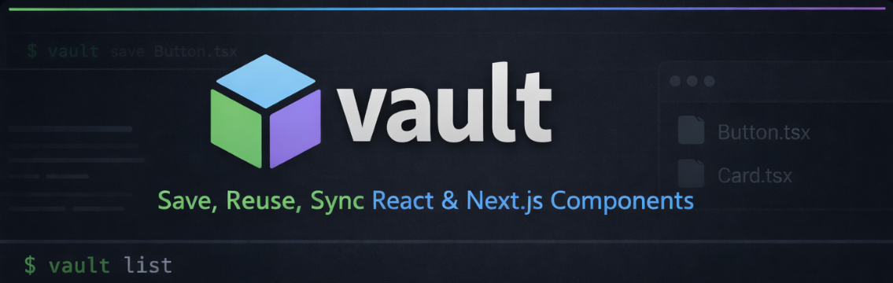

# vault



A lightweight CLI tool for managing reusable React and Next.js components.

Save components from any project into a local registry, list them, and sync them with a GitHub repository for reuse across multiple codebases. Instead of copy-pasting components between projects or maintaining separate component libraries, vault provides a fast, filesystem-based workflow that fits naturally into existing development habits.

## Features

- **Save** - Store components in a local vault for quick access
- **List** - View all saved components at a glance
- **Sync** - Push/pull components to GitHub for cross-project sharing _(coming soon)_

## Installation

### From Source

```bash
git clone https://github.com/yourusername/vault.git
cd vault
go build -o vault
```

### Move to PATH (optional)

```bash
# Linux/macOS
sudo mv vault /usr/local/bin/

# Or add to your local bin
mv vault ~/.local/bin/
```

## Usage

### Save a component

```bash
vault save <path-to-file>
```

Save any file to your local vault:

```bash
vault save ./components/Button.tsx
vault save ./hooks/useAuth.ts
vault save ./lib/utils.ts
```

Save files with another name:

```bash
vault save ./Button.tsx --name RoundButton.tsx
```

### List saved components

```bash
vault list
```

View all components currently stored in your vault.

## How It Works

vault uses a simple filesystem-based approach:

1. Components are stored in `.vault/components/` relative to where you run the command
2. Files are saved with their original filenames
3. No configuration files or databases required

## Project Structure

```
your-project/
├── .vault/
│   └── components/     # Your saved components live here
├── src/
└── ...
```

## Roadmap

- [x] Custom naming with `--name` flag
- [ ] GitHub sync support
- [ ] Component categories/tags
- [ ] Search functionality
- [ ] Config file support

## Contributing

Contributions are welcome! Feel free to open issues or submit pull requests.

## License

MIT
